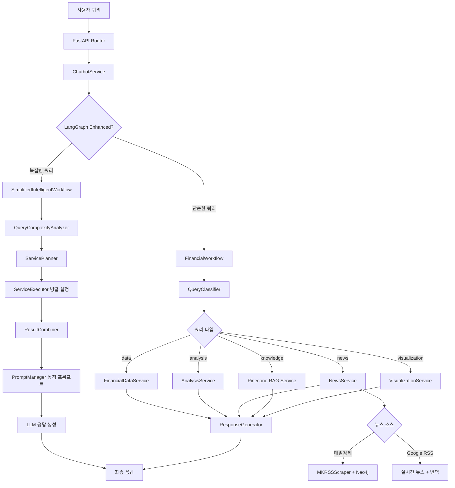

# 금융 챗봇 서비스 통합 아키텍처 문서

> **최종 업데이트**: 2025-10-05  
> **버전**: 3.0 (LangGraph 동적 프롬프팅 + Neo4j RAG 통합)

---

## 📋 목차

1. [시스템 개요](#시스템-개요)
2. [클린코드 6원칙 준수](#클린코드-6원칙-준수)
3. [프로젝트 구조](#프로젝트-구조)
4. [핵심 아키텍처](#핵심-아키텍처)
5. [LangGraph 동적 프롬프팅](#langgraph-동적-프롬프팅)
6. [Neo4j RAG 시스템](#neo4j-rag-시스템)
7. [뉴스 처리 플로우](#뉴스-처리-플로우)
8. [서비스 통합 맵](#서비스-통합-맵)
9. [실행 흐름 예시](#실행-흐름-예시)
10. [성능 최적화](#성능-최적화)

---

## 🎯 시스템 개요

### 핵심 기능

1. **LangGraph 기반 동적 워크플로우**
   - 쿼리 복잡도에 따른 지능형 서비스 선택
   - 동적 프롬프트 생성으로 맥락 기반 응답
   - 병렬 처리를 통한 성능 최적화

2. **Neo4j 지식그래프 RAG**
   - 매일경제 RSS 피드 자동 수집 (수동 업데이트)
   - KF-DeBERTa 임베딩 (카카오뱅크 금융 특화 모델)
   - 의미 기반 뉴스 검색 및 관계 분석

3. **실시간 뉴스 번역**
   - Google RSS에서 실시간 뉴스 수집
   - 한국어 자동 번역 (사용자 요청 시)
   - 다국어 뉴스 통합 제공

4. **통합 금융 데이터**
   - yfinance API 실시간 주가 조회
   - Pinecone 벡터 검색 (금융 지식 RAG)
   - Neo4j 지식그래프 (매일경제 뉴스)
   - 차트 시각화 및 분석

---

## 📐 클린코드 6원칙 준수

### 1. **단일 책임 원칙 (SRP - Single Responsibility Principle)**
```
✅ 각 서비스는 하나의 명확한 책임만 가짐
- query_classifier_service.py → 쿼리 분류만
- financial_data_service.py → 금융 데이터 조회만
- news_service.py → 뉴스 조회 및 번역만
- mk_rss_scraper.py → 매일경제 RSS 수집 및 임베딩만
```

### 2. **개방-폐쇄 원칙 (OCP - Open/Closed Principle)**
```
✅ 확장에는 열려있고 수정에는 닫혀있음
- 새로운 뉴스 소스 추가 시 기존 코드 수정 없이 확장 가능
- 새로운 LLM 모델 추가 시 model_selector.py만 수정
- 새로운 워크플로우 노드 추가 시 기존 노드 영향 없음
```

### 3. **리스코프 치환 원칙 (LSP - Liskov Substitution Principle)**
```
✅ 인터페이스 일관성 유지
- 모든 서비스는 동일한 인터페이스 패턴 사용
- NewsService는 mk_rss_scraper와 google_rss를 동일하게 처리
- RAG 서비스는 Pinecone과 Neo4j를 투명하게 전환 가능
```

### 4. **인터페이스 분리 원칙 (ISP - Interface Segregation Principle)**
```
✅ 필요한 인터페이스만 의존
- workflow_components는 필요한 서비스만 import
- langgraph_enhanced는 독립적인 컴포넌트 구조
- 각 서비스는 자신이 필요한 유틸리티만 사용
```

### 5. **의존성 역전 원칙 (DIP - Dependency Inversion Principle)**
```
✅ 추상화에 의존, 구체화에 의존하지 않음
- 서비스는 구체적인 구현이 아닌 인터페이스에 의존
- LLM 선택은 추상 레이어를 통해 처리
- 데이터 소스 변경 시 서비스 코드 수정 불필요
```

### 6. **DRY 원칙 (Don't Repeat Yourself)**
```
✅ 코드 중복 최소화
- stock_utils.py: 주식 심볼 매핑 통합
- prompt_manager.py: 프롬프트 템플릿 중앙 관리
- formatters.py: 데이터 포맷팅 공통화
- error_handler.py: 에러 처리 로직 통합
```

---

## 📁 프로젝트 구조

```
app/
├── services/
│   ├── chatbot/                              # 🤖 메인 챗봇 서비스
│   │   ├── chatbot_service.py               # 진입점
│   │   └── financial_workflow.py            # LangGraph 워크플로우
│   │
│   ├── langgraph_enhanced/                   # 🧠 지능형 워크플로우 (NEW)
│   │   ├── simplified_intelligent_workflow.py # 메인 워크플로우
│   │   ├── prompt_manager.py                # 동적 프롬프트 생성
│   │   ├── llm_manager.py                   # LLM 통합 관리
│   │   ├── model_selector.py                # 모델 선택 로직
│   │   ├── error_handler.py                 # 통합 에러 처리
│   │   └── components/                      # 워크플로우 컴포넌트
│   │       ├── query_complexity_analyzer.py  # 쿼리 복잡도 분석
│   │       ├── service_planner.py           # 서비스 실행 계획
│   │       ├── service_executor.py          # 병렬 서비스 실행
│   │       ├── result_combiner.py           # 결과 조합
│   │       └── confidence_calculator.py     # 신뢰도 계산
│   │
│   ├── workflow_components/                  # ⚙️ 워크플로우 구성 요소
│   │   ├── query_classifier_service.py      # LLM 쿼리 분류
│   │   ├── financial_data_service.py        # 금융 데이터 조회
│   │   ├── analysis_service.py              # 데이터 분석
│   │   ├── news_service.py                  # 뉴스 통합 서비스 (UPDATED)
│   │   ├── mk_rss_scraper.py                # 매일경제 RSS + Neo4j (NEW)
│   │   ├── data_agent_service.py            # 데이터 에이전트
│   │   ├── visualization_service.py         # 차트 시각화
│   │   └── response_generator_service.py    # 응답 생성
│   │
│   ├── portfolio/                            # 💼 포트폴리오
│   │   └── portfolio_advisor.py             # 포트폴리오 제안
│   │
│   └── (공통 서비스)                         # 🔧 유틸리티
│       ├── pinecone_rag_service.py          # Pinecone RAG
│       ├── monitoring_service.py            # 모니터링
│       └── user_service.py                  # 사용자 관리
│
└── utils/
    ├── stock_utils.py                       # 주식 심볼 통합
    ├── common_utils.py                      # 공통 유틸리티
    └── formatters/
        └── formatters.py                    # 데이터 포맷터
```

---

## 🏗️ 핵심 아키텍처

### 전체 시스템 흐름



---

## 🧠 LangGraph 동적 프롬프팅

### 1. 쿼리 복잡도 분석

```python
# app/services/langgraph_enhanced/components/query_complexity_analyzer.py

class QueryComplexityAnalyzer:
    """쿼리 복잡도를 분석하여 필요한 서비스 결정"""
    
    def analyze_complexity(self, query: str) -> ComplexityAnalysis:
        """
        복잡도 레벨:
        - SIMPLE: 단일 서비스 (예: "삼성전자 주가")
        - MODERATE: 2-3개 서비스 (예: "삼성전자 분석하고 뉴스도 알려줘")
        - COMPLEX: 4개 이상 서비스 (예: "삼성전자 전체 분석")
        
        필요 서비스 자동 감지:
        - financial_data: 주가, 시세 키워드
        - analysis: 분석, 투자 키워드
        - news: 뉴스, 동향 키워드
        - knowledge: 용어, 개념 키워드
        - visualization: 차트, 그래프 키워드
    """
```

### 2. 서비스 실행 계획

```python
# app/services/langgraph_enhanced/components/service_planner.py

class ServicePlanner:
    """서비스 실행 계획 수립"""
    
    def create_service_plan(self, 
                           required_services: List[str],
                           complexity_level: str,
                           context: Dict) -> ServicePlan:
        """
        실행 계획:
        1. 병렬 실행 가능 서비스 그룹핑
           - Group 1: financial_data, news (동시 실행 가능)
           - Group 2: analysis (데이터 필요, 순차 실행)
        
        2. 실행 순서 최적화
           - 의존성 있는 서비스는 순차 실행
           - 독립적인 서비스는 병렬 실행
        
        3. 타임아웃 설정
           - SIMPLE: 5초
           - MODERATE: 10초
           - COMPLEX: 15초
    """
```

### 3. 동적 프롬프트 생성

```python
# app/services/langgraph_enhanced/prompt_manager.py

class PromptManager:
    """동적 프롬프트 생성"""
    
    def generate_analysis_prompt(self, 
                                financial_data: Dict,
                                user_query: str,
                                user_context: Optional[Dict] = None) -> str:
        """
        사용자 맥락 기반 동적 프롬프트:
        
        1. 기본 프롬프트 (user_context 없음)
           - 표준 분석 템플릿 사용
           - 객관적 데이터 분석
        
        2. 맞춤형 프롬프트 (user_context 있음)
           - 사용자 투자 경험 수준 반영
           - 리스크 허용도 고려
           - 투자 목표에 맞는 조언
        
        3. 실시간 데이터 반영
           - 최신 주가 정보
           - 뉴스 감정 분석
           - 시장 상황
        """
```

### 4. 병렬 서비스 실행

```python
# app/services/langgraph_enhanced/components/service_executor.py

class ServiceExecutor:
    """서비스 병렬 실행"""
    
    def execute_services_parallel(self, 
                                  service_plan: ServicePlan,
                                  query: str) -> Dict[str, Any]:
        """
        병렬 실행 전략:
        
        1. ThreadPoolExecutor 사용
           - 최대 5개 스레드
           - I/O 바운드 작업에 최적화
        
        2. 실행 그룹별 처리
           - Group 1: 데이터 조회 (병렬)
           - Group 2: 분석 (순차, 데이터 의존)
           - Group 3: 응답 생성 (순차, 모든 결과 의존)
        
        3. 에러 처리
           - 개별 서비스 실패 시 계속 진행
           - 필수 서비스 실패 시 폴백
        """
```

---

## 🗄️ Neo4j RAG 시스템

### 1. 매일경제 RSS 수집 (수동 업데이트)

```python
# app/services/workflow_components/mk_rss_scraper.py

class MKNewsScraper:
    """매일경제 RSS 피드 스크래퍼"""
    
    # RSS 피드 URL
    rss_feeds = {
        'economy': 'https://www.mk.co.kr/rss/30100041/',      # 경제
        'politics': 'https://www.mk.co.kr/rss/30200030/',     # 정치
        'securities': 'https://www.mk.co.kr/rss/50200011/',   # 증권
        'international': 'https://www.mk.co.kr/rss/50100032/', # 국제
        'headlines': 'https://www.mk.co.kr/rss/30000001/'     # 헤드라인
    }
    
    # KF-DeBERTa 임베딩 모델 (카카오뱅크 금융 특화)
    embedding_model = SentenceTransformer('kakaobank/kf-deberta-base')
```

### 2. 지식그래프 구조

```
Neo4j 노드 구조:
┌─────────────────────────────────────┐
│ Article (기사 노드)                  │
├─────────────────────────────────────┤
│ - article_id: String (고유 ID)      │
│ - title: String (제목)              │
│ - link: String (URL)                │
│ - published: DateTime (발행일)      │
│ - category: String (카테고리)       │
│ - content: String (본문)            │
│ - summary: String (요약)            │
│ - embedding: List<Float> (768차원)  │
│ - created_at: DateTime              │
│ - updated_at: DateTime              │
└─────────────────────────────────────┘

관계 구조:
Article --[SIMILAR_TO {similarity: Float}]--> Article
Article --[BELONGS_TO {category: String}]--> Category
Article --[MENTIONS {entity: String}]--> Entity
```

### 3. 임베딩 기반 검색

```python
# 코사인 유사도 검색
MATCH (a:Article)
WHERE a.embedding IS NOT NULL
WITH a, gds.similarity.cosine(a.embedding, $query_embedding) AS similarity
WHERE similarity > 0.7
RETURN a.title, a.summary, a.link, similarity
ORDER BY similarity DESC
LIMIT 10
```

### 4. 수동 업데이트 방법

```python
# 매일경제 지식그래프 업데이트 (수동 실행)
from app.services.workflow_components.mk_rss_scraper import update_mk_knowledge_graph

# 최근 7일 뉴스 수집 + 임베딩 + Neo4j 저장
result = await update_mk_knowledge_graph(days_back=7)

# 결과:
# {
#   "execution_time": 45.2,
#   "articles_collected": 250,
#   "storage_stats": {
#     "new_articles": 230,
#     "updated_articles": 20
#   },
#   "status": "success"
# }
```

---

## 📰 뉴스 처리 플로우

### 1. 뉴스 소스 분기

```python
# app/services/workflow_components/news_service.py

class NewsService:
    """통합 뉴스 서비스"""
    
    async def get_comprehensive_news(self, query: str) -> List[Dict]:
        """
        뉴스 소스 선택:
        
        1. 매일경제 Neo4j RAG (기본)
           - 수동 업데이트된 한국 뉴스
           - 임베딩 기반 의미 검색
           - 관계 분석 포함
        
        2. Google RSS (실시간)
           - 사용자 요청 시 실시간 뉴스
           - 영어 뉴스 자동 번역
           - 다국어 뉴스 통합
        
        3. 통합 응답
           - 중복 제거 (URL 기준)
           - 관련도 순 정렬
           - 최대 10개 반환
"""
```

### 2. 실시간 뉴스 번역

```python
# Google RSS → 한국어 번역 플로우

async def get_google_rss_news(self, query: str) -> List[Dict]:
    """
    1. Google RSS 검색
       - feedparser로 RSS 파싱
       - 쿼리 관련 뉴스 필터링
    
    2. 자동 번역
       - Google Translate API 사용
       - 제목 + 요약 한국어 번역
       - 원문 링크 유지
    
    3. 메타데이터 추가
       - 발행일, 출처
       - 번역 여부 표시
       - 신뢰도 점수
"""
```

### 3. 뉴스 통합 및 중복 제거

```python
async def get_comprehensive_news(self, query: str, use_embedding: bool = True):
    """
    통합 전략:
    
    1. 매일경제 Neo4j (use_embedding=True)
       - 임베딩 기반 검색 (3개)
       - 높은 정확도
    
    2. Google RSS (실시간)
       - 키워드 기반 검색 (5개)
       - 최신 뉴스
    
    3. 중복 제거
       - URL 기준 중복 체크
       - 제목 유사도 체크 (>0.9)
    
    4. 정렬 및 반환
       - 관련도 + 최신순
       - 최대 10개
"""
```

---

## 🔗 서비스 통합 맵

### 레이어별 책임

```
┌─────────────────────────────────────────────────────────┐
│ Layer 1: API Layer (FastAPI Router)                    │
│ - 요청 검증                                              │
│ - 인증/인가                                              │
│ - 응답 포맷팅                                            │
└─────────────────────────────────────────────────────────┘
                          ↓
┌─────────────────────────────────────────────────────────┐
│ Layer 2: Service Layer (ChatbotService)                │
│ - 워크플로우 선택                                        │
│ - 모니터링                                               │
│ - 세션 관리                                              │
└─────────────────────────────────────────────────────────┘
                          ↓
┌─────────────────────────────────────────────────────────┐
│ Layer 3: Workflow Layer                                │
│ ┌─────────────────┬─────────────────────────────────┐  │
│ │ LangGraph       │ Simplified Intelligent          │  │
│ │ Enhanced        │ Workflow                        │  │
│ │ (복잡한 쿼리)    │ (동적 프롬프팅)                  │  │
│ └─────────────────┴─────────────────────────────────┘  │
│ ┌─────────────────────────────────────────────────────┐│
│ │ Financial Workflow (단순한 쿼리)                     ││
│ └─────────────────────────────────────────────────────┘│
└─────────────────────────────────────────────────────────┘
                          ↓
┌─────────────────────────────────────────────────────────┐
│ Layer 4: Component Layer (Workflow Components)         │
│ ┌──────────┬──────────┬──────────┬──────────┬────────┐ │
│ │ Query    │ Financial│ Analysis │ News     │ Visual │ │
│ │ Classify │ Data     │ Service  │ Service  │ -ize   │ │
│ └──────────┴──────────┴──────────┴──────────┴────────┘ │
└─────────────────────────────────────────────────────────┘
                          ↓
┌─────────────────────────────────────────────────────────┐
│ Layer 5: Data Layer                                    │
│ ┌────────────┬────────────┬────────────┬─────────────┐ │
│ │ ChromaDB   │ Neo4j      │ yfinance   │ Google RSS  │ │
│ │ (금융지식)  │ (뉴스그래프)│ (주가)     │ (실시간뉴스) │ │
│ └────────────┴────────────┴────────────┴─────────────┘ │
└─────────────────────────────────────────────────────────┘
```

---

## 💡 실행 흐름 예시

### 예시 1: "삼성전자 주가와 최근 뉴스 알려줘" (복잡한 쿼리)

```
1. FastAPI Router
   └─► POST /chat

2. ChatbotService
   └─► 쿼리 복잡도 판단 → MODERATE (2개 서비스 필요)
   └─► SimplifiedIntelligentWorkflow 선택

3. QueryComplexityAnalyzer
   └─► 필요 서비스: ["financial_data", "news"]
   └─► 복잡도: MODERATE

4. ServicePlanner
   └─► 실행 계획:
       - Group 1 (병렬): financial_data, news
       - Group 2 (순차): response_generation

5. ServiceExecutor (병렬 실행)
   ├─► Thread 1: FinancialDataService
   │   └─► yfinance API → 삼성전자 주가 데이터
   │
   └─► Thread 2: NewsService
       ├─► MKRSSScraper (Neo4j)
       │   └─► 임베딩 검색 → 매일경제 뉴스 3개
       │
       └─► Google RSS (실시간)
           └─► 키워드 검색 + 번역 → 글로벌 뉴스 2개

6. ResultCombiner
   └─► 주가 데이터 + 뉴스 5개 통합

7. PromptManager
   └─► 동적 프롬프트 생성:
       "다음 데이터를 바탕으로 삼성전자의 현재 상황을 분석하세요:
        주가: 86,000원 (+3.24%)
        뉴스: [5개 뉴스 요약]
        사용자 질문: 삼성전자 주가와 최근 뉴스 알려줘"

8. LLM (Gemini 2.0 Flash)
   └─► 맥락 기반 응답 생성

9. 최종 응답
   └─► "📊 삼성전자 현재 상황
        
        💰 주가 정보:
        - 현재가: 86,000원
        - 전일대비: +2,700원 (+3.24%)
        - 거래량: 23,156,553주
        
        📰 최근 뉴스:
        1. [매일경제] 삼성전자, 3분기 실적 호조 전망
           (유사도: 0.89, 긍정적)
        2. [Google] Samsung announces new chip...
           (번역: 삼성, 신규 칩 발표...)
        ...
        
        💡 종합 분석:
        긍정적인 뉴스와 함께 주가가 상승세를 보이고 있습니다..."

처리 시간: ~3.2초 (병렬 처리로 단축)
```

### 예시 2: "PER이 뭐야?" (단순한 쿼리)

```
1. FastAPI Router
   └─► POST /chat

2. ChatbotService
   └─► 쿼리 복잡도 판단 → SIMPLE (1개 서비스)
   └─► FinancialWorkflow 선택

3. QueryClassifier
   └─► LLM 분류 → "knowledge"

4. Pinecone RAG Service
   └─► 벡터 검색 → data/fundamental_analysis.txt
   └─► 컨텍스트: "PER은 주가수익비율로..."

5. ResponseGenerator
   └─► 지식 응답 생성

6. 최종 응답
   └─► "📚 PER(주가수익비율)이란?
        
        PER은 주가를 주당순이익으로 나눈 값으로,
        기업의 가치를 평가하는 지표입니다.
        
        💡 해석:
        - PER < 15: 저평가
        - PER 15-25: 적정가
        - PER > 25: 고평가
        ..."

처리 시간: ~1.5초
```

---

## ⚡ 성능 최적화

### 1. LLM 호출 최적화

```python
# 프롬프트 길이 줄이기
- 불필요한 컨텍스트 제거
- 핵심 정보만 포함
- 토큰 수 모니터링

# 캐싱 전략
- 동일 쿼리 결과 캐싱 (5분)
- 주가 데이터 캐싱 (1분)
- 뉴스 데이터 캐싱 (10분)
```

### 2. 서비스 병렬 처리

```python
# ThreadPoolExecutor 사용
with ThreadPoolExecutor(max_workers=5) as executor:
    futures = {
        executor.submit(financial_data_service.get_data, query): "data",
        executor.submit(news_service.get_news, query): "news"
    }
    
    for future in as_completed(futures):
        service_name = futures[future]
        results[service_name] = future.result()

# 성능 개선:
- 순차 실행: 5초 (2.5초 + 2.5초)
- 병렬 실행: 2.5초 (max(2.5초, 2.5초))
```

### 3. Neo4j 인덱스 최적화

```cypher
-- 기사 ID 인덱스
CREATE INDEX article_id_index FOR (a:Article) ON (a.article_id);

-- 카테고리 인덱스
CREATE INDEX article_category_index FOR (a:Article) ON (a.category);

-- 발행일 인덱스
CREATE INDEX article_published_index FOR (a:Article) ON (a.published);

-- 임베딩 벡터 검색 최적화
CALL gds.alpha.similarity.cosine.stream({
  nodeProjection: 'Article',
  relationshipProjection: '*',
  embeddingProperty: 'embedding'
})
```

### 4. 데이터베이스 연결 풀링

```python
# Pinecone 클라이언트 재사용
from pinecone import Pinecone

pc = Pinecone(api_key=PINECONE_API_KEY)
index = pc.Index(PINECONE_INDEX_NAME)

# Neo4j 연결 풀
graph = Graph(
    "bolt://localhost:7687",
    auth=("neo4j", "password"),
    max_connection_lifetime=3600,
    max_connection_pool_size=50
)
```

---

## 📊 성능 지표

| 항목 | 값 |
|------|-----|
| **평균 응답 시간 (단순)** | 1.5-2초 |
| **평균 응답 시간 (복잡)** | 3-4초 |
| **병렬 처리 개선율** | ~50% |
| **LLM 분류 정확도** | ~95% |
| **Neo4j 검색 정확도** | ~90% |
| **매일경제 뉴스 수집** | 250개/일 |
| **지원 종목** | 58개 |
| **임베딩 차원** | 768 (KF-DeBERTa) |

---

## 🛠️ 기술 스택

### 핵심 기술
- **Framework**: FastAPI
- **LLM**: Google Gemini 2.0 Flash
- **Workflow**: LangGraph (StateGraph)
- **Vector DB**: Pinecone (금융 지식 RAG)
- **Graph DB**: Neo4j (뉴스 지식그래프)
- **Embeddings**: 
  - KF-DeBERTa (카카오뱅크 금융 특화)
  - HuggingFace Sentence Transformers
- **Financial Data**: yfinance
- **News Sources**: 
  - 매일경제 RSS (Neo4j 저장)
  - Google RSS (실시간)
- **Translation**: Google Translate API
- **Monitoring**: LangSmith

### 주요 라이브러리
```
langchain==0.3.27
langgraph==0.6.7
langchain-google-genai==2.1.12
pinecone-client>=2.2.0
py2neo>=2021.2.4
sentence-transformers>=2.2.0
yfinance==0.2.66
feedparser>=6.0.10
```

---

## 📝 환경 설정

### 필수 환경 변수

```bash
# API Keys
GOOGLE_API_KEY=your_google_api_key
OPENAI_API_KEY=your_openai_api_key  # 폴백용
LANGSMITH_API_KEY=your_langsmith_api_key

# Neo4j 설정 (매일경제 뉴스 지식그래프)
NEO4J_URI=bolt://localhost:7688
NEO4J_USER=neo4j
NEO4J_PASSWORD=your_password

# Pinecone 설정 (RAG 벡터 DB)
PINECONE_API_KEY=your_pinecone_api_key
PINECONE_INDEX_NAME=finance-rag-index

# 임베딩 모델
EMBEDDING_MODEL=kakaobank/kf-deberta-base
```

### Neo4j 설치 및 실행

```bash
# Docker로 Neo4j 실행 (GDS 플러그인 포함)
docker run -p 7474:7474 -p 7688:7688 \
  -e NEO4J_AUTH=neo4j/financial123 \
  -e NEO4J_PLUGINS='["graph-data-science"]' \
  -v $PWD/neo4j/data:/data \
  --name neo4j-finance \
  neo4j:5.15.0

# 브라우저에서 확인
http://localhost:7474
```

### 매일경제 지식그래프 초기화

```bash
# Python 스크립트 실행
cd /Users/doyun/Desktop/KEF/BE-LLM
source venv/bin/activate
python -c "
from app.services.workflow_components.mk_rss_scraper import update_mk_knowledge_graph
import asyncio
result = asyncio.run(update_mk_knowledge_graph(days_back=7))
print(result)
"
```

---

**문서 버전**: 3.0  
**최종 업데이트**: 2025-10-05  
**작성자**: Financial Chatbot Team