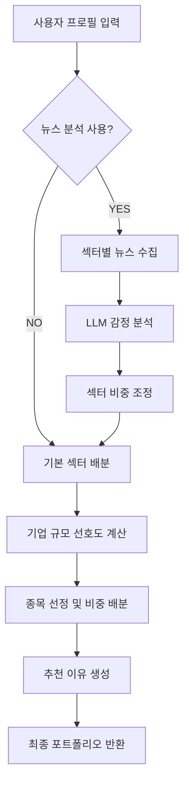

# 고도화된 포트폴리오 추천 시스템 가이드

## 개요

뉴스 분석과 기업 규모 선호도를 반영한 고도화된 포트폴리오 추천 시스템입니다. 기존 기본 추천 시스템에서 다음 기능들이 추가되었습니다:

- 🔥 **실시간 뉴스 분석**: 섹터별 최신 뉴스 수집 및 감정 분석을 통한 전망 평가
- 🏢 **기업 규모 분류**: 시가총액 기반 대기업/중견기업/중소기업 자동 분류
- 👤 **개인화된 규모 선호도**: 투자 성향별 기업 규모 선호도 자동 적용
- 📊 **동적 비중 조정**: 뉴스 전망에 따른 섹터별 투자 비중 동적 조정

## API 엔드포인트

### 1. 기본 포트폴리오 추천 (기존)

**Endpoint:** `POST /api/v1/portfolio`

기존 방식의 포트폴리오 추천 (하위 호환성 보장)

### 2. 고도화된 포트폴리오 추천 (신규)

**Endpoint:** `POST /api/v1/portfolio/enhanced`

**파라미터:**
- `use_news_analysis` (선택, boolean): 뉴스 분석 사용 여부 (기본: true)

#### Request Body (동일)

```json
{
  "profileId": 1,
  "userId": "user123",
  "investmentProfile": "안정형",
  "availableAssets": 10000000,
  "lossTolerance": "30",
  "financialKnowledge": "보통",
  "expectedProfit": "150",
  "investmentGoal": "학비",
  "interestedSectors": ["전기·전자", "기타금융", "화학"]
}
```

#### Response

```json
{
  "timestamp": "2025-10-11T09:05:42.892Z",
  "code": "SUCCESS",
  "message": "고도화된 포트폴리오 추천 성공 (뉴스 분석 포함)",
  "result": {
    "portfolioId": 1,
    "userId": "user123",
    "recommendedStocks": [
      {
        "stockId": "005930",
        "stockName": "삼성전자",
        "allocationPct": 15,
        "sectorName": "전기·전자",
        "reason": "전기·전자 섹터의 삼성전자은(는) 시장 지배력이 높은 대기업으로 최근 전기·전자 섹터의 긍정적 전망과 함께 안정적인 시장 지위를 바탕으로 귀하의 안정 추구 성향에 매우 적합하며 꾸준한 배당 수익도 기대할 수 있어 안정적인 투자처로 추천됩니다."
      }
    ],
    "allocationSavings": 80,
    "createdAt": "2025-10-11T09:05:42.892Z",
    "updatedAt": "2025-10-11T09:05:42.892Z"
  }
}
```

## 주요 기능 상세

### 1. 실시간 뉴스 분석

#### 뉴스 수집 소스
- **매일경제 RSS**: 한국어 금융 뉴스 (Neo4j 지식그래프 활용)
- **Google RSS**: 글로벌 영문 뉴스 (실시간 번역)
- **FallbackAgent**: 자동 실패 복구

#### 감정 분석 프로세스
1. 섹터별 키워드 매핑 및 뉴스 수집
2. Gemini LLM을 통한 감정 분석
3. 감정 점수 (-1.0 ~ +1.0) 산출
4. 섹터별 비중 조정값 계산 (-15% ~ +15%)

#### 예시 섹터 키워드
```yaml
전기·전자: ["반도체", "semiconductor", "electronics", "chip"]
IT 서비스: ["IT", "software", "platform", "cloud", "AI"]
제약: ["제약", "pharmaceutical", "biotech", "drug development"]
```

### 2. 기업 규모 분류

#### 분류 기준 (시가총액 기준)
| 규모 | 시가총액 범위 | 특징 |
|------|-------------|------|
| 대기업 | 10조원 이상 | 시장 지배력, 안정성 |
| 중견기업 | 1조원 ~ 10조원 | 균형잡힌 성장성과 안정성 |
| 중소기업 | 1조원 미만 | 높은 성장 잠재력 |

#### 예시 분류 결과
```
삼성전자 (496조) → 대기업
SK하이닉스 (252조) → 대기업
카카오 (26조) → 대기업
NICE 평가정보 (8천억) → 중소기업
```

### 3. 투자 성향별 기업 규모 선호도

| 투자 성향 | 대기업 | 중견기업 | 중소기업 | 전략 |
|----------|-------|--------|--------|------|
| 안정형 | 0.9 | 0.6 | 0.3 | 대기업 중심 |
| 안정추구형 | 0.8 | 0.7 | 0.4 | 대기업 선호 |
| 위험중립형 | 0.7 | 0.7 | 0.6 | 균형 배분 |
| 적극투자형 | 0.6 | 0.8 | 0.7 | 중견기업 선호 |
| 공격투자형 | 0.5 | 0.8 | 0.9 | 중소기업 포함 |

### 4. 추가 개인화 요소

#### 금융 지식도별 조정
- **매우 낮음**: 대기업 +10%p, 중소기업 -10%p
- **매우 높음**: 대기업 -10%p, 중소기업 +10%p

#### 손실 허용도별 조정  
- **10% (보수적)**: 대기업 +10%p, 중소기업 -10%p
- **100% (적극적)**: 대기업 -10%p, 중소기업 +10%p

## 알고리즘 플로우



## 테스트 예시

### 안정형 투자자 비교

#### 기본 추천
```json
{
  "allocationSavings": 80,
  "recommendedStocks": [
    {"stockName": "삼성전자", "allocationPct": 8, "reason": "국내 대표 기업으로..."}
  ]
}
```

#### 고도화된 추천 (뉴스 분석 포함)
```json
{
  "allocationSavings": 80,
  "recommendedStocks": [
    {
      "stockName": "삼성전자", 
      "allocationPct": 10,
      "reason": "전기·전자 섹터의 삼성전자은(는) 시장 지배력이 높은 대기업으로 최근 전기·전자 섹터의 긍정적 전망과 함께..."
    }
  ]
}
```

**차이점**: 뉴스 전망 반영으로 비중 +2%p, 상세한 추천 이유

### 공격투자형 투자자

- **대기업 선호도**: 0.5 (낮음)
- **중소기업 선호도**: 0.9 (높음)
- **결과**: 중소기업 및 고변동성 종목 포함
- **예적금 비율**: 20% (기본 룰 유지)

## 성능 및 신뢰성

### 뉴스 분석 성능
- **평균 응답 시간**: 15-30초 (섹터당)
- **신뢰도 임계값**: 0.6 이상일 때만 비중 조정 적용
- **실패 복구**: 뉴스 분석 실패 시 기본 추천으로 자동 전환

### 캐싱 및 최적화
- **뉴스 중복 제거**: URL 및 제목 기반
- **배치 처리**: 최대 3개 섹터씩 동시 분석
- **API 부하 방지**: 요청 간 0.5초 딜레이

## 사용 방법

### 1. 기본 사용
```bash
curl -X POST http://localhost:8000/api/v1/portfolio/enhanced \
  -H "Content-Type: application/json" \
  -d '{"userId": "user123", "investmentProfile": "안정형", ...}'
```

### 2. 뉴스 분석 제외
```bash
curl -X POST http://localhost:8000/api/v1/portfolio/enhanced?use_news_analysis=false \
  -H "Content-Type: application/json" \
  -d '{"userId": "user123", "investmentProfile": "공격투자형", ...}'
```

### 3. 테스트 스크립트 실행
```bash
./tests/test_enhanced_portfolio_endpoint.sh
```

## 에러 처리

### 일반적인 에러 상황
1. **뉴스 수집 실패**: 기본 추천으로 자동 전환
2. **LLM 분석 실패**: 키워드 기반 폴백 분석
3. **네트워크 타임아웃**: 캐시된 데이터 또는 중립 전망 적용

### 에러 응답 예시
```json
{
  "timestamp": "2025-10-11T09:05:42.892Z",
  "code": "INTERNAL_ERROR",
  "message": "고도화된 포트폴리오 추천 중 오류가 발생했습니다: 뉴스 분석 실패"
}
```

## 향후 개선 사항

- [ ] 뉴스 분석 결과 캐싱 (1시간)
- [ ] 사용자별 포트폴리오 히스토리 저장
- [ ] 실시간 주가 연동
- [ ] 백테스팅 기능 추가  
- [ ] 모바일 최적화된 경량 버전
- [ ] 다국어 뉴스 소스 확장

## 파일 구조

```
app/services/portfolio/
├── portfolio_recommendation_service.py    # 기본 추천 서비스
├── enhanced_portfolio_service.py          # 고도화된 추천 서비스 ⭐
├── sector_analysis_service.py             # 섹터 뉴스 분석 서비스 ⭐
└── portfolio_advisor.py                   # 기존 어드바이저 (유지)

app/utils/
└── portfolio_stock_loader.py              # 기업 규모 분류 추가 ⭐

tests/
├── test_enhanced_portfolio_api.py         # 고도화된 시스템 테스트 ⭐
└── test_enhanced_portfolio_endpoint.sh    # API 엔드포인트 테스트 ⭐
```

## 결론

고도화된 포트폴리오 추천 시스템은 기존 시스템의 안정성을 유지하면서도, 실시간 시장 정보와 개인화된 선호도를 반영하여 더욱 정교하고 맞춤화된 투자 포트폴리오를 제공합니다. 

**핵심 장점:**
- 🔄 **실시간성**: 최신 뉴스 반영
- 🎯 **개인화**: 세밀한 투자 성향 고려  
- 🛡️ **안정성**: 실패 시 기본 추천으로 복구
- 📈 **확장성**: 모듈화된 구조로 기능 추가 용이
